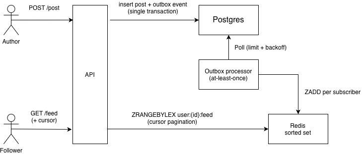

# Описание

Бекенд клона твиттера на Go c возможностью регистрации пользователя, публикации постов, подписки на авторов и чтения персонализированного фида.
Проект ставил своей целью показать продакшн архитектуру высоконагруженного бекенда: transactional outbox, fan-out-on-write систему фидов, интеграционные тесты с помощью testcontainers, и поддержка OpenTelemetry.

## Особенности

- **Аутентификация** — Регистрация/Логин пользователя с хешированием паролей с помощью argon2id, реализация JWT access токенов с подписью Ed25519, ротация токенов и реализация logout
- **Посты** — Публикация и удаление постов, возможность простомотра постов пользователя
- **Подписки** — Возможность подписываться/отписываться от авторов
- **Персональные фиды** — fan-out-on-write посылка постов в фиды подписанных пользователей, курсорная пагинация при чтении фида пользователем
- **API документация** — Swagger docs доступны по адресу `/swagger/index.html`
- **Наблюдаемость** — Интегрирован OTel, трейсы и логи посылаются в Uptrace; 
  Также использованы обёртки для gin, pgx и Redis

## Пополнение фидов: fan-out-on-write

При посылке поста в одной транзакции происходит его запись в БД и добавление события в таблицу outbox. В фоне отдельный процесс батчами читает события и добавляет записи в фиды подписчиков — отсортированные множества в Redis, значения в которых отсортированы лексикографически по правилу `(created_at, post_id)`, что позволяет реализовать курсорную пагинацию одним запросом `ZRANGE BYLEX`. 

Design trade-offs:

- **Почему не fan-in-on-read**: количество чтений в разы больше числа записей в базу данных, текущее решение перекладывает тяжеловесную логику расчёта фидов на более редкие записи, что превращает чтения в простое обращение к кешу. В fan-in-on-read реализации нам бы пришлось делать слияние из N независимых источников
- **Гарантии доставки**: паттерн outbox дает нам at-least-once delivery гарантию, консюмеры индемпотентны благодаря использованию (`ZADD`/`ZREM`), так что повторная логика обработки собитий ничего не ломает
- **Задержка при записи**: Запись со стороны клиента не вносит вклад в задержку,
так как пропагация в фиды подписчиков происходит в фоне
- **Модель консистентности**: При условии стабильной работы кеша фиды пользователей
гарантируют модель eventually consistent, в случай падения — часть данных может быть восстановлена 
прогревом кеша с помощью повторного выполнения событий, которые сохранились в таблице outbox
- **Ограничения реализации**: Для пользователей с большим количеством подписчиков модель 
fan-out-on-write становится не выгодной, их стоит обрабатывать по другому — заставлять читателей отдельно получать информацию о их постах с отдельным курсором личным для каждого популярного аккаунта 

### Схема


### Структура проекта

```
config/          чтение конфигурации из env переменных (JWT ключи, строки подключения)
internal/
  handlers/      HTTP эндпоинты (gin)
  services/      бизнес логика
  repositories/  Postgres (sqlc) + декораторы для кеширования
  cache/         Redis: post cache, subscription cache, feed sorted sets
  processors/    outbox потребитель с экспоненциальным откатом при ошибке
  middleware/    JWT аутентификация, обработчик ошибок
  database/      код сгенерированный sqlc
  telemetry/     настройка OTel
migrations/      миграции
sql/             написанные SQL запросы, по которым sqlc генерирует методы
docs/            сгенерированная Swagger документация
```

## Стек проекта

- **Go 1.26**, gin, pgx/v5, sqlc, goose
- **PostgreSQL 16**, **Redis 8**
- **OpenTelemetry** (OTLP gRPC) + Uptrace
- **Swagger** (swaggo)
- **testcontainers-go**, testify
- **Docker** / docker compose, GitHub Actions CI

## API overview

Корень: `/api/v1`. Интерактивная документация: `http://localhost:9090/swagger/index.html`.

| Метод  | Путь                      | Auth    | Описание                         |
|--------|---------------------------|---------|----------------------------------|
| POST   | `/auth/register`          | —       | Создать аккаунт                  |
| POST   | `/auth/login`             | —       | Получить access + refresh токены |
| POST   | `/auth/refresh`           | refresh | Ротация токенов                  |
| POST   | `/auth/logout`            | refresh | Блокировка refresh токена        |
| POST   | `/post`                   | access  | Публикация поста                 |
| DELETE | `/post/:post_id`          | access  | Удаление поста                   |
| GET    | `/feed`                   | access  | Персональный фид с курсором      |
| GET    | `/user/:user_id/posts`    | —       | Получить посты автора с курсором |
| POST   | `/user/:author_id/subs`   | access  | Подписаться                      |
| DELETE | `/user/:author_id/subs`   | access  | Отписаться                       |

## Запуск проекта

### Docker (всё включено)

```bash
cp .env.example .env
docker compose up --build
```

Запускает сервер на `:9090`, PostgreSQL, Redis, и Uptrace
(UI на `:14318`), запускает миграции на одноразовом контейнере.
Значения переменных подставляются из `.env`: помимо переменных приложения
compose использует `WEB_PORT`, `POSTGRES_USER`, `POSTGRES_PASSWORD`,
`POSTGRES_DB` и `REDIS_PASSWORD`.

### Локальная разработка

Необходимо: Go 1.26, PostgreSQL, Redis.

```bash
cp .env.example .env
goose -dir migrations postgres "$DATABASE_URL" up
go run .
```

Переменные проекта:

| Переменная         | Описание                                           |
|--------------------|----------------------------------------------------|
| `DATABASE_URL`     | строка подключения Postgres                        |
| `REDIS_URL`        | строка подключения Redis                           |
| `JWT_SECRET`       | Ed25519 private key, PKCS8 PEM                     |
| `SERVER_PORT`      | Порт сервера (default `8080`)                      |
| `IS_RELEASE`       | `1` = bind `0.0.0.0`, gin release mode             |
| `OTLP_GRPC_ADDRESS`| OTLP эндпоинт                                      |
| `UPTRACE_DSN`      | Uptrace DSN                                        |
| `ARGON2_MEMORY`    | память argon2id в KiB (default `65536`)            |

Генерация ключей:

```bash
openssl genpkey -algorithm ed25519
```

## Тесты

Тесты разделены на два тега `unit` и `integration`, первые просто тестируют пути выполнения,
вторые — развертывают контейнеры.

```bash
go test -race -tags=unit ./...          # fast, no Docker
go test -race -tags=integration ./...   # full stack
```

CI пайплайн запускает `go vet`, `gofmt -s`, `go mod tidy` а так же запускает тесты.
Дополнительно добавлены проверки запрещающие PR в `main` из любых веток кроме `develop`.

## Генерация кода

```bash
sqlc generate            # sql/*.sql -> internal/database
swag init -g internal/routes/routes.go   # handlers -> docs/
```
